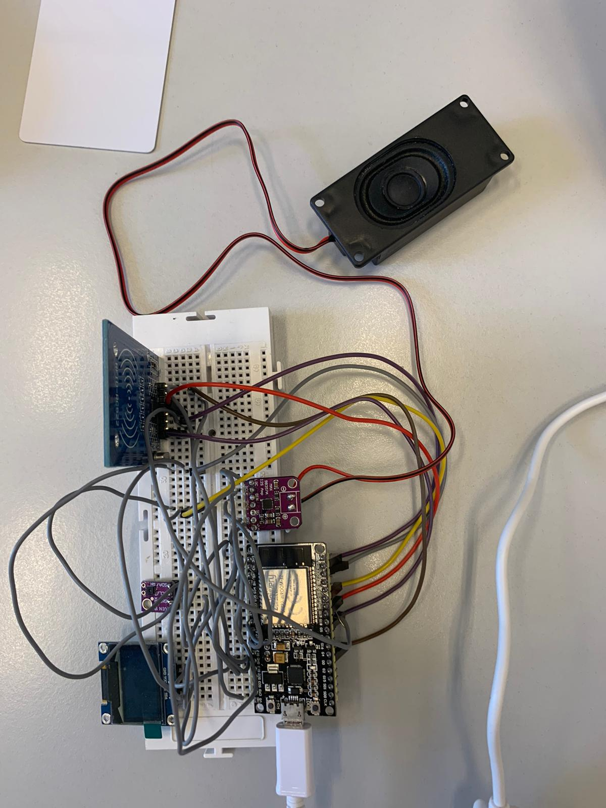

### Oriol Garcia Moreiras
###                                    </p>
    Processadors Digitals

</p>

# </br> PROYECTO:  ACCESO temperatura y humedad </p>

## Materiales interrupción por GPIO
 Placa ESP32 con el respectivo cable para conectar al pc,
 Sensor de temperatura y humedad
 Display,
 Amplificador,
 Altavoces,
 Lector RFID con la respectiva targeta,
 Cables y
 Protoboard.

 


## </br> 2.1 CÓDIGO: 
```c++
#include <Arduino.h>
#include "SSD1306Wire.h"   
#include <Wire.h>
#include "ClosedCube_SHT31D.h"
#include <Adafruit_I2CDevice.h>
#include <SPI.h>
#include <MFRC522.h> //https://github.com/miguelbalboa/rfid
#include "WiFi.h"
#include "Audio.h"  
#define SS_PIN        5
#define RST_PIN       0
#define I2S_DOUT      25
#define I2S_BCLK      27
#define I2S_LRC       26

void init_temp_hum_task(void);

SSD1306Wire display(0x3c, SDA, SCL);  
ClosedCube_SHT31D sht3xd;

int demoMode = 0;
int counter = 1;

float humd, temp;

const int ipaddress[4] = {103, 97, 67, 25};
byte nuidPICC[4] = {0, 0, 0, 0};
MFRC522::MIFARE_Key key;
MFRC522 rfid = MFRC522(SS_PIN, RST_PIN);
MFRC522 mfrc522(SS_PIN, RST_PIN); ///Creamos el objeto para el RC522

void printDec(byte *buffer, byte bufferSize);
void printHex(byte *buffer, byte bufferSize);
void displayRFID(void);
boolean compareArray(byte array1[],byte array2[]);


byte ActualUID[4]; //almacenará el código del Tag leído
byte Usuario1[4]= {0x30, 0xC9, 0x53, 0x0C} ; //código del usuario 1
byte Usuario2[4]= {0xA4, 0x05, 0x60, 0x26} ; //código del usuario 2

Audio audio;

String ssid = "iPhone";
String password = "1234567890";

void audioTask(void *parameter);
void terminal();

int cont = 0;

void setup()
{
	Wire.begin();

  // Initialising the UI will init the display too.

	Serial.begin(115200);

  WiFi.disconnect();
  WiFi.mode(WIFI_STA);
  WiFi.begin(ssid.c_str(), password.c_str());
  while (WiFi.status() != WL_CONNECTED) delay(1500);
  Serial.println("Conectado!");
  audio.setPinout(I2S_BCLK, I2S_LRC, I2S_DOUT);
  audio.setVolume(21); // 0...21

	Serial.println("ClosedCube SHT3X-D Periodic Mode Example");
	Serial.println("supports SHT30-D, SHT31-D and SHT35-D");

	sht3xd.begin(0x44); // I2C address: 0x44 or 0x45

	Serial.print("Serial #");
	Serial.println(sht3xd.readSerialNumber());

	if (sht3xd.periodicStart(SHT3XD_REPEATABILITY_HIGH, SHT3XD_FREQUENCY_10HZ) != SHT3XD_NO_ERROR)
		Serial.println("[ERROR] Cannot start periodic mode");

  display.init();

   display.flipScreenVertically();
  display.setFont(ArialMT_Plain_16);
   display.setTextAlignment(TEXT_ALIGN_CENTER);
   display.drawString(128/2, 25, "BIENVENIDO");
  display.display();
  delay(2000);
  display.resetDisplay();
  
  display.setFont(ArialMT_Plain_10);
   display.setTextAlignment(TEXT_ALIGN_CENTER);
   display.drawString(128/2, 25, "ESCANEE SU TARJETA");
  display.display();
  delay(2000);

   Serial.println(F("Initialize System"));
 //init rfid D8,D5,D6,D7
 SPI.begin();
 rfid.PCD_Init();
 Serial.print(F("Reader :"));
 rfid.PCD_DumpVersionToSerial();

    Serial.begin(9600); //Iniciamos La comunicacion serial
    SPI.begin();        //Iniciamos el Bus SPI
    mfrc522.PCD_Init(); // Iniciamos el MFRC522
    Serial.println("Control de acceso:");


  xTaskCreatePinnedToCore(
    audioTask, // Task function. 
    "audioTask", // name of task. 
    10000, // Stack size of task 
    NULL, // parameter of the task 
    1, // priority of the task 
    NULL,
    0); // Task handle to keep track of created task 

}


void printDec(byte *buffer, byte bufferSize) {
 for (byte i = 0; i < bufferSize; i++) {
   Serial.print(buffer[i] < 0x10 ? " 0" : " ");
   Serial.print(buffer[i], DEC);
 }
}

/**
   Helper routine to dump a byte array as hex values to Serial.
*/
void printHex(byte *buffer, byte bufferSize) {
 for (byte i = 0; i < bufferSize; i++) {
   Serial.print(buffer[i] < 0x10 ? " 0" : " ");
   Serial.print(buffer[i], HEX);
 }
}
/**
   Helper routine to dump a byte array as dec values to Serial.
*/

void audioTask(void *parameter){
  // loop forever
   Serial.println("this is another audioTask");
  for(;;){
    audio.loop();
    delay(1);
  }
  // delete a task when finish,
  // this will never happen because this is infinity loop 
  vTaskDelete( NULL );
}

void loop(){  
  if ( mfrc522.PICC_IsNewCardPresent()) { //Seleccionamos una tarjeta
      if ( mfrc522.PICC_ReadCardSerial()) {
                  // Enviamos serialemente su UID
          Serial.print(F("Card UID:"));
           for (byte i = 0; i < mfrc522.uid.size; i++) {
             Serial.print(mfrc522.uid.uidByte[i] < 0x10 ? " 0" : " ");
             Serial.print(mfrc522.uid.uidByte[i], HEX);
             ActualUID[i]=mfrc522.uid.uidByte[i];
                  } 
                  Serial.print("     ");
                  //comparamos los UID para determinar si es uno de nuestros usuarios
                  if(compareArray(ActualUID,Usuario1)or(compareArray(ActualUID,Usuario2))){                  
                    if (cont!=0){
                      audio.stopSong();
                    } 
                    char woffer[50];
                    sprintf(woffer,"Acceso concedido, Bienvenido");
                    Serial.println(woffer);
                    audio.connecttospeech(woffer, "es");
                    delay(1000);
                    terminal();
                    displayRFID();
                    cont++;
                  }
                   else {
                   char woffer[50];
                   sprintf(woffer,"Acceso denegado, intentelo de nuevo");
                   Serial.println(woffer);
                   audio.connecttospeech(woffer, "es");
                   delay(1000);
                   }
                  cont++;
                }

                  // Terminamos la lectura de la tarjeta tarjeta  actual
                  mfrc522.PICC_HaltA();

            }

}

void terminal(){

SHT31D result = sht3xd.periodicFetchData();
humd = result.rh;
temp = result.t;

Serial.print("Time:");
  Serial.print(millis());
  Serial.print(" Temperature:");
  Serial.print(temp, 1);
  Serial.print("C");
  Serial.print(" Humidity:");
  Serial.print(humd, 1);
  Serial.print("%");

  Serial.println();

  delay(1000);

}


void displayRFID() {

SHT31D result = sht3xd.periodicFetchData();

display.clear();
  

  display.setTextAlignment(TEXT_ALIGN_CENTER);
  display.setFont(ArialMT_Plain_10);
  display.drawString(128/2, 0, "HUMEDAD");
  display.setFont(ArialMT_Plain_16);
  display.drawString(128/2, 11, String(humd)+ "%");
  display.setFont(ArialMT_Plain_10);
  display.drawString(128/2, 30, "TEMPERATURA");
  display.setFont(ArialMT_Plain_16);
  display.drawString(128/2, 41, String(temp)+ "ºC");

  // write the buffer to the display
  display.display();

  delay(100);  
}

//Función para comparar dos vectores
 boolean compareArray(byte array1[],byte array2[])
{
  if(array1[0] != array2[0])return(false);
  if(array1[1] != array2[1])return(false);
  if(array1[2] != array2[2])return(false);
  if(array1[3] != array2[3])return(false);
  return(true);
}


void printResult(String text, SHT31D result) {
	if (result.error == SHT3XD_NO_ERROR) {
		Serial.print(text);
		Serial.print(": T=");
		Serial.print(result.t);
		Serial.print("C, RH=");
		Serial.print(result.rh);
		Serial.println("%");
	} else {
		Serial.print(text);
		Serial.print(": [ERROR] Code #");
		Serial.println(result.error);
	}

}
```
## </br> Explicación proyecto

A continuación se muestra una foto del circuito final:



Aquí podemos ver como están conectados todos los componentes utilizando algunos pines.

Una vez tengamos conectado el circuito final al ordenador, mediante el cable de la placa, seleccionaremos la opción de upload and monitor. Al escoger esta opción, el programa empezará a cargar en la placa y conectará, pero antes tendremos que apretar el botón de boot. Una vez llegue al 100% nos saldrá en el display un primer mensaje que pondrá 'BIENVENIDO', y un segundo que dirá 'ESCANEE SU TARJETA', una vez sigas las instrucciones hay dos opciones:
1. Que la tarjeta no tenga los permisos adecuados y, por tanto, escuches por el altavoz el siguiente mensaje 'Acceso denegado, inténtelo de nuevo'
2. Que la tarjeta si tenga los permisos adecuados y escuches el siguiente mensaje por el altavoz 'Acceso concedido, bienvenido' y seguidamente se muestra por pantalla la temperatura y humedad del ambiente.


